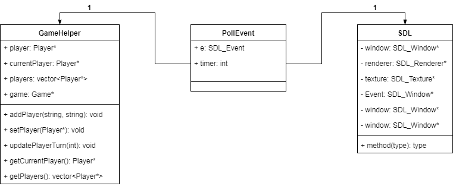

# Project Postmortem

## Introduction

This is a postmortem of the project. In the UMLs section an overview of the
design is presented. The rest of the document discusses design decisions, the
new requirements and some other relevant information.

## UMLs

This section presents UMLs of the design.
To keep things simple it only shows the more important methods and fields.

### MVC Design

This is an overview of the MVC model.

### Model Big Picture

This is an overview of the Model.

## Design Decisions

This section discusses some of the key design descisions.
